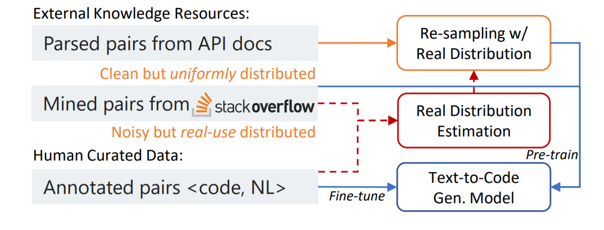
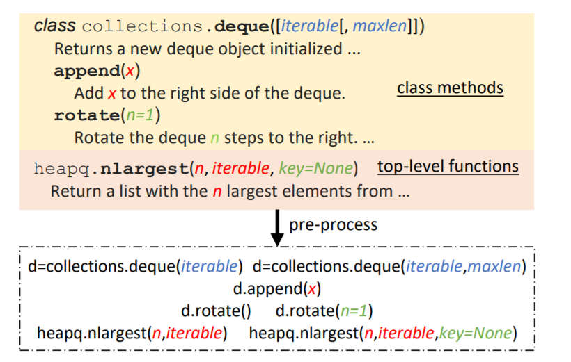

# Incorporating External Knowledge through Pre-training for Natural Language to Code Generation

This repository contains code and resources for the ACL20 paper ["Incorporating External Knowledge through Pre-training for Natural Language to Code Generation"](https://arxiv.org/abs/2004.09015).
Some of the code is borrowed from the awesome [TranX](https://github.com/pcyin/tranx) semantic parsing software.
If you are interested in the underlying neural code generation model used in this paper, please have a look!

## TL;DR
Open-domain code generation aims to generate code in a general-purpose programming language (such as Python) from natural language (NL) intents. Motivated by the intuition that developers usually retrieve resources on the web when writing code, we explore the effectiveness of incorporating two varieties of external knowledge into NL-to-code generation: automatically mined NL-code pairs from the online programming QA forum StackOverflow and programming language API documentation. Our evaluations show that combining the two sources with data augmentation and retrieval-based data re-sampling improves the current state-of-the-art by up to 2.2% absolute BLEU score on the code generation testbed CoNaLa.

If you want to try out our strong pre-trained English-to-Python generation models, check out [this section](#provided-state-of-the-art-model).

Our approach: incorporating external knowledge by data re-sampling, pre-training and fine-tuning.



Examples from Python API documentation and pre-processed code snippets, including class constructors, methods, and top-level functions. We use red, blue, and green to denote required, optional positional, and optional keyword arguments respectively.



Performance comparison of different strategies to incorporate external knowledge.


## Prepare Environment
We recommend using `conda` to manage the environment:
```
conda env create -n "tranx" -f config/conda_environment.yml
conda activate tranx
```

Some key dependencies and their versions are:
- python=3.7
- pytorch=1.1.0
- astor=0.7.1 (This is very important)

## Getting and Preprocessing External Resources

One of the most important steps presented in the paper is the external knowledge/resources used for pre-training the code generation model.
We will show how we obtain the StackOverflow mined data as well as the Python API documentation and the preprocessing steps.

### Mined StackOverflow Pairs
Download [conala-corpus-v1.1.zip](http://www.phontron.com/download/conala-corpus-v1.1.zip) and unzip the content into `data/conala/`.
Make sure you have `conala-(mined|train|test).jsonl` in that directory.

### Python Standard Library API Documentation
We provide our processed API documents into our data format which is the same as the aforementioned Conala dataset.
You can find the preprocessed NL-code pairs at `apidocs/python-docs.jsonl`.

However, if you prefer to process the API documents from scratch, you need to first download the official Python source code from [here](https://www.python.org/downloads/source/), in this paper, we use the documentation from Python 3.7.5.
extract everything into `apidocs/Python-3.7.5`.
Then `cd` into that directory, and follow the [instructions](https://github.com/python/cpython/tree/master/Doc) to build the HTML version of the Python documentation.
Basically it's `make venv` followed by `make html`.

After this, please check `apidocs/Python-3.7.5/Doc/build/html/library` directory to see if the generated HTML library documentations are there. Yay!

To actually parse all the documentation and output the same NL-code pair format as the model supports, please run `apidocs/doc_parser.py`, which would generate `apidocs/python-docs.jsonl`.

## Resampling API Knowledge
As we found in the paper, external knowledge from different sources has different characteristics.
NL-code pairs automatically mined from StackOverflow are good representatives of the questions that developers may ask, but are inevitably noisy.
NL-code pairs from API documentation are clean, but there may be a topical distribution shift from real questions asked by developers.
We show that resampling the API documentation is crucial to minimize the distribution gap and improve pretraining performance.

You can find resampled API corpus as used in the experiments in the paper in `apidocs/processed`.
`direct` contains corpus resampled via "direct retrieval".
`distsmpl` contains corpus resampled via "distribution estimation".
Both are compared in the experiments, and `distsmpl` has better performance.
The filenames of the resampled corpus represent different strategies.
`snippet` or `intent` means retrieved by code snippet or NL intent.
`tempX` means the temperature parameter is X.
`topK` means top K retrieval results are used for resampling.

If you are interested in performing the resampling step on your own, you will need to load `python-docs.jsonl` into an [ElasticSearch](https://github.com/elastic/elasticsearch) instance that provides retrieval functionality.
Check out `apidocs/index_es.py` for indexing the API documents, and `apidocs/retrieve.py` for actual retrieval and resampling.

## Pretraining and Finetuning Underlying Code Generation Model
For this part, our underlying model is [TranX](https://github.com/pcyin/tranx) for code generation, and the code is modified and integrated in this repo.

Our paper's training strategy is basically 3-step: pretrain on mined + API data, finetune on [CoNaLa](https://conala-corpus.github.io/) dataset, and rerank.

### Preprocess all the data into binarized dataset and vocab.
All related operations are in `datasets/conala/dataset.py`.

For our best performing experiment, with is mined (top 100K) + API (dist. resampled w/ code, k = 1 and t = 2), run the following to create the dataset:

```
mkdir data/conala
python datasets/conala/dataset.py --pretrain path/to/conala-mined.jsonl --topk 100000 --include_api apidocs/processed/distsmpl/snippet_15k/goldmine_snippet_count100k_topk1_temp2.jsonl
```

By default things should be preprocessed and saved to `data/conala`. Check out those `.bin` files.

### Pretraining

Check out the script `scripts/conala/train_retrieved_distsmpl.sh` for our best performing strategy. Under the directory you could find scripts for other strategies compared in the experiments as well.

Basically, you have to specify number of mined pairs (50k or 100k), retrieval method (`snippet_count100k_topk1_temp2`, etc.):
```
scripts/conala/train_retrieved_distsmpl.sh 100000 snippet_count100k_topk1_temp2
``` 
If anything goes wrong, make sure you have already preprocessed the corresponding dataset/strategy in the previous step.

The best model will be saved to `saved_models/conala`

### Finetuning

Check out the script `scripts/conala/finetune_retrieved_distsmpl.sh` for best performing finetuning on CoNaLa training dataset (clean).
The parameters are similar as above, number of mined pairs (50k or 100k), retrieval method (`snippet_count100k_topk1_temp2`, etc.), and additionally, the previous pretrained model path:
```
scripts/conala/finetune_retrieved_distsmpl.sh 100000 snippet_count100k_topk1_temp2 saved_models/conala/retdistsmpl.dr0.3.lr0.001.lr_de0.5.lr_da15.beam15.vocab.src_freq3.code_freq3.mined_100000.goldmine_snippet_count100k_topk1_temp2.bin.pre_100000_goldmine_snippet_count100k_topk1_temp2.bin.seed0.bin
``` 
For other strategies, modify accordingly and refer to other `finetune_xxx.sh` scripts.
The best model will also be saved to `saved_models/conala`.

### Reranking
Reranking is not the core part of this paper, please refer to [this branch](https://github.com/pcyin/tranX/tree/rerank) and [the paper](https://www.aclweb.org/anthology/P19-1447.pdf).
This is an orthogonal post-processing step.

In general, you will first need to obtain the decoded hypothesis list after beam-search of the train/dev/test set in CoNaLA, and train the reranking weight on it.

To obtain decodes, run `scripts/conala/decode.sh <train/dev/test_data_file> <model_file>`.
The outputs will be saved at `decodes/conala`

Then, train the reranker by `scripts/conala/rerank.sh <decode_file_prefix>.dev.bin.decode/.test.decode`

For easy use, we provide our trained reranker at `best_pretrained_models/reranker.conala.vocab.src_freq3.code_freq3.mined_100000.intent_count100k_topk1_temp5.bin`

### Test
This is easy, just run `scripts/conala/test.sh saved_models/conala/<model_name>.bin`

## Provided State-of-the-art Model
The best models are provided at `best_pretrained_models/` directories, including the neural model as well as trained reranker weights.

First, checkout our [online demo](http://moto.clab.cs.cmu.edu:8081/).

Second, we also provide an easy to use HTTP API for code generation.
### Web Server/HTTP API
To start the web server with our state-of-the-art model, simply run:

```
conda activate tranx
python server/app.py --config_file config/config_conala.json
```

The config file contains the path to our best models under `best_pretrained_models`.

This will start a web server at port 8081.

**HTTP API** To programmically query the model to get semantic parsing results, send your HTTP GET request to

```
http://<IP Address>:8081/parse/conala/<utterance>

# e.g., http://localhost:8081/parse/conala/reverse a list
```


## Reference
```
@inproceedings{xu20aclcodegen,
    title = {Incorporating External Knowledge through Pre-training for Natural Language to Code Generation},
    author = {Frank F. Xu and Zhengbao Jiang and Pengcheng Yin and Graham Neubig},
    booktitle = {Annual Conference of the Association for Computational Linguistics},
    year = {2020}
}
```


## Thanks
Most of the code for the underlying neural model is adapted from [TranX](https://github.com/pcyin/tranx) software, and the [CoNaLa challenge dataset](https://conala-corpus.github.io/).

We are also grateful to the following previous papers that inspire this work :P
```
@inproceedings{yin18emnlpdemo,
    title = {{TRANX}: A Transition-based Neural Abstract Syntax Parser for Semantic Parsing and Code Generation},
    author = {Pengcheng Yin and Graham Neubig},
    booktitle = {Conference on Empirical Methods in Natural Language Processing (EMNLP) Demo Track},
    year = {2018}
}

@inproceedings{yin18acl,
    title = {Struct{VAE}: Tree-structured Latent Variable Models for Semi-supervised Semantic Parsing},
    author = {Pengcheng Yin and Chunting Zhou and Junxian He and Graham Neubig},
    booktitle = {The 56th Annual Meeting of the Association for Computational Linguistics (ACL)},
    url = {https://arxiv.org/abs/1806.07832v1},
    year = {2018}
}

Abstract Syntax Networks for Code Generation and Semantic Parsing.
Maxim Rabinovich, Mitchell Stern, Dan Klein.
in Proceedings of the Annual Meeting of the Association for Computational Linguistics, 2017

The Zephyr Abstract Syntax Description Language.
Daniel C. Wang, Andrew W. Appel, Jeff L. Korn, and Christopher S. Serra.
in Proceedings of the Conference on Domain-Specific Languages, 1997
```
